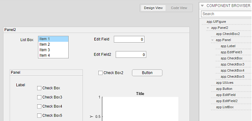

# mlAppFlex

 tool to enhance your work with `MATLAB App Designer` (.mlapp)
 ease maintenance,  changes and reusing elements

## 

[TOC]


# [ I ] Motivation


## Creating Apps is easy...

... using MATLAB App Designer is   almost as easy
as working with an  spreadsheet.

<!--  -->

## Maintaining ...
... `App Designer`  `(AD)` projects is  a nightmare
More sophisticated apps ...

* slow down the editor

* don't offer code folding

* don't have  a  visual hierarchy on code level

  

<!---->

## Reusing your code is almost impossible

* Copy-paste takes care of the  `UI elements` but the `Callbacks` have to added again **manually**. 
* Every manual step is just one more possibility to **@!&$** up everything.

It is more safe to create a new app than to risk sessions of debugging.

 **Effectively, the Aps are Single Use Apps**


The core of apps designed with `AD` is a `classdef` .   `properties` and `methods` can serve as a **socket** to call other `classes` function or scripts. Unfortunately, `AD` currently does not offer deeper structuring on the code level.  


# [ III ] The Solution 

 Let's ... borrow ...  the concept of **views**  and **activities** from other IDEs such as Android Studio or any other.

Going through the possible combinations I came up with three different views/activities: 

+ **host** which has a `UI Figure` serving as a socket

+ **plugins** which (each) have a `UI Panel` as the highest structural element

+ **popups** with an `UI Figure` to save real estate

  |                                                        | <p style ="color: green">host</p> |   <p style ="color: green">plugin</p>    | <p style ="color: green">popup</p>  |
  | :----------------------------------------------------- | :-------------------------------: | :--------: | :---: |
  | <p style ="color: red">highest structural element </p> |            `UI Figure`            | `UI Panel` | both  |
  | <p style ="color: red">can live...</p>                 |            autonomous             | dependent  | both  |
  | <p style ="color: red">serves as...</p>                |           socket board            |  content   | both  |

  

The resulting first degree tree structure could look like this. 
Of course every popup and plugin could have plugins and popups themselves.


# [ III ] Usage

## [a] Create *new* Projects

A new copy of the git can be starting point.


``` cmd
$ git clone https://github.com/erkandem/mlAppFlex.git
```


``` matlab
>> run
```

## [b] migrate *existing* Projects


download and extract or clone the files wherever you want


###  1) Select one app as a host 

But all your menu and menu callbacks in this app. 

You may want to add single panel at most  (a welcome page, or a 404 page ).


### 2) add  dummy properties


which will load all the elements into the dummy properties. The properties do not need to be defined and can therefore be anything from a double to an abstract object.

```matlab
 properties (Access = public)
        m1home
        m2_launch    % plugin (content)
     %  [ ... ]      % more plugins
        m3_help      % plugin (about, help, licence, etc...)
        m4_calculate % plugin
     %  [ ... ] 
 end
```

If there is no `properties` section you can create one in the `editor` panel:


### 4) add a startup function 


Now call the creator methods of the classes to be embedded in your host

### 5)  use a `UI Panel` for all your`UI elements ` 

|       |   |
| :---------------------------------------------------: | :---------------------------------------------------------: |
|  |  |

### 6) popups  

To save real estate we would typically move settings and anything else which is only needed temporarily needed to an popup. create the menu item and add the creator to the menu items callback function.

### 7 ) code extraction

is well documented


```matlab
% in courtesy of [StackOverflowMATLABchat](https://github.com/StackOverflowMATLABchat)
evalcstr = sprintf('type(''%s‘’)’, 'app.mlapp')); % Output: 'type('app.mlapp')'
myMcode = evalc(evalcstr); 

```


### 8) modify obtained code

either delete or comment out different parts of the code which typically attributed to standalone apps.

input parameters for the main UI Panel need to be changed, too.


### 9) path management

MATLAB is convenient since you do not need to import anything in any script once you added the path of a function /class/script/... to the *search path*. But this can also be *very* undesirable if one needs to have multiple versions of any function in different environments.

A workaround would be to add all the obtained .m files to the *search path*  without saving them.


## Installation

```
git clone https://github.com/erkandem/mlAppFlex.git
```

or  download and unzip in your desired location

## Usage example

A few motivating and useful examples of how your product can be used. Spice this up with code blocks and potentially more screenshots.

_For more examples and usage, please refer to the [Wiki][wiki]._

## Release History

-  Initial commit 07 / 2018

  

## Contact

Erkan Demiralay – 

Github: [@erkandem](https://github.com/erkandem/) 

Email: ed@ivsurface.com


GitHub:

Distributed under the MIT license. See ``LICENSE`` for more information


## Contributing

Sure. 


# thank you 

[typora](https://typora.io/) -   mark down editor

[sharex](https://getsharex.com/) screen recording (video, gif, single image)


[mlapp2classdef](https://github.com/StackOverflowMATLABchat/mlapp2classdef) code snippets and inspiration